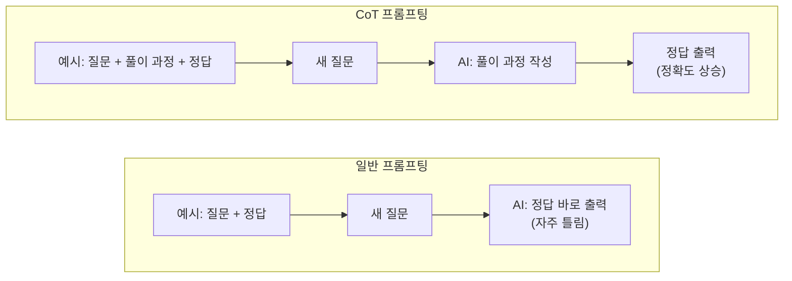
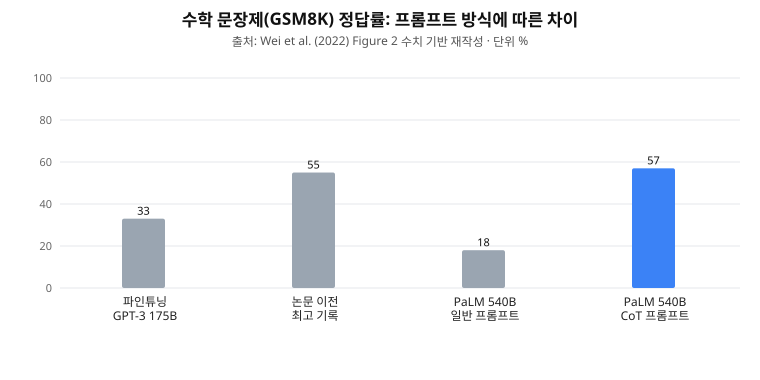
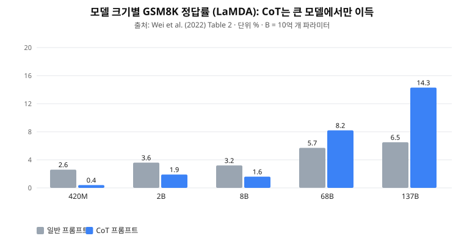
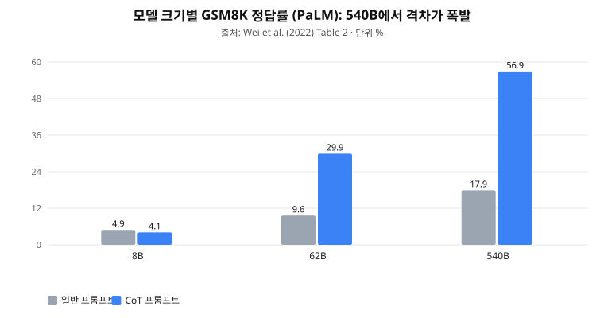

# "AI에게 풀이 과정을 쓰게 했더니 똑똑해졌다": Chain-of-Thought 프롬프팅

> **논문**: *Chain-of-Thought Prompting Elicits Reasoning in Large Language Models*
> **저자**: Jason Wei 외 8명 (Google Research, Brain Team) · **발표**: NeurIPS 2022 · **원문**: arXiv:2201.11903
> **한 줄 요약**: AI에게 예시를 보여줄 때 "정답"만 주지 않고 **"정답에 이르는 풀이 과정"까지 함께 보여주면**, 복잡한 문제를 훨씬 잘 푼다.

**이 문서에 대하여**
- AI를 몰라도 읽을 수 있게 배경부터 설명합니다. 이미 아시는 부분은 건너뛰어도 됩니다.
- 논문 원문을 길게 옮기는 대신, **원문 위치(Section, Figure, Table 번호)** 를 표시해 두었으니 원문과 대조하며 읽을 수 있습니다.
- 그래프는 논문의 수치를 바탕으로 **직접 다시 그린 것**입니다. 논문 원본 그림은 원문에서 확인하세요.
- **[논문]** 은 논문에 있는 내용, **[추론]** 은 제가 실무에 맞춰 덧붙인 해석입니다.

---

## 1. 배경: 이 논문을 이해하기 위한 기초

### 1-1. 대규모 언어모델(LLM)이란?
ChatGPT 같은 AI의 핵심 엔진입니다. 엄청난 양의 글을 읽고 "다음에 올 단어"를 맞히도록 훈련된 프로그램입니다. 이 논문이 쓴 모델은 GPT-3, LaMDA, PaLM 등이고, 크기는 **파라미터 수**(모델 안의 조정 가능한 숫자 개수)로 잽니다. 예를 들어 540B는 5,400억 개입니다.

### 1-2. 프롬프트와 few-shot
- **프롬프트(prompt)**: AI에게 주는 입력문입니다. 질문, 지시, 예시가 모두 프롬프트입니다.
- **few-shot 프롬프팅**: AI를 새로 훈련시키지 않고, 프롬프트에 "문제와 정답" 예시 몇 개를 먼저 보여준 다음 실제 문제를 푸는 방식입니다.
  - 비유: 신입사원에게 "이렇게 처리하면 돼요" 하고 사례 몇 개를 보여준 뒤 실제 업무를 맡기는 것과 같습니다.
  - 장점: 데이터를 모아 훈련시킬 필요가 없고, 하나의 모델로 여러 일을 시킬 수 있습니다.

### 1-3. 기존 방식의 한계: "직감으로 찍는 AI"
당시 AI는 번역, 요약, 간단한 질의응답은 잘했지만 **여러 단계를 거쳐야 하는 문제**에서는 약했습니다.

> 예: "로저는 테니스공 5개가 있다. 공 3개씩 든 캔 2개를 더 샀다. 지금 공은 몇 개?"

사람은 "5개 + (3개 × 2캔 = 6개) = 11개"처럼 **중간 계산을 거쳐** 답합니다. 그런데 AI는 곧바로 답을 내놓으려다 틀리는 일이 많았습니다. 모델을 키워도 이 유형은 성능이 잘 오르지 않았습니다(논문 Introduction).

### 1-4. 이 논문의 핵심 아이디어
"사람처럼 **풀이 과정을 적으면서** 풀게 하면 어떨까?" 예시에 정답뿐 아니라 **풀이 과정(chain of thought, 사고의 사슬)** 을 넣어서 보여줍니다. 그러면 AI도 새 문제를 풀 때 풀이 과정을 먼저 쓰고 그 위에서 답을 냅니다.

---

## 2. 방법: 무엇이 달라졌나 (원문 Figure 1, Section 2)

같은 문제에 대한 두 가지 프롬프트 방식을 비교합니다.

| | 일반 프롬프팅 (Standard) | CoT 프롬프팅 |
|---|---|---|
| 예시에 넣는 것 | 질문 → **정답만** | 질문 → **풀이 과정 + 정답** |
| 예시 문구 | "답은 11이다." | "로저는 처음에 5개. 캔 2개에 3개씩이니 6개. 5+6=11. 답은 11이다." |
| AI의 행동 | 답을 바로 출력 | 풀이를 먼저 쓰고 답을 출력 |



**세 가지 요소(논문은 `<입력, 추론 과정, 출력>` 트리플이라 부름)**
1. 입력: 문제
2. 추론 과정: 답까지 이르는 단계별 설명(자연어)
3. 출력: 최종 답

**실험 방식 [논문]**: 사람이 직접 만든 예시 **8개**를 프롬프트에 넣었습니다. AI를 추가로 훈련(파인튜닝)하지는 않았습니다(Section 3.1).

**저자들이 꼽은 CoT의 장점 4가지 (Section 2)**
1. 어려운 문제를 **여러 중간 단계로 쪼개** 풀 수 있고, 어려운 문제일수록 더 많은 "생각"을 쓸 수 있다.
2. AI가 **어떻게 답에 도달했는지 볼 수 있어서**, 틀렸을 때 어디서 어긋났는지 확인하고 고칠 수 있다.
3. 수학, 상식, 기호 조작 등 **언어로 풀 수 있는 거의 모든 문제**에 쓸 수 있다.
4. 새로 훈련하지 않고 **예시만 바꿔 넣으면** 기성 모델에서 바로 쓸 수 있다.

---

## 3. 결과: 얼마나 좋아졌나

### 3-1. 수학 문장제 (원문 Figure 2, Section 3.2)
초등학교 수준의 여러 단계 문장제 문제집(GSM8K)에서 PaLM 540B의 정답률은 다음과 같습니다.



- **[논문]** 일반 프롬프트 18% → CoT 프롬프트 57%. 문제집 하나를 위해 **별도로 훈련한** 기존 최고 기록(55%)까지 프롬프트만으로 넘어섰습니다.
- 원문 위치: 정확한 수치는 Table 2, 요약 그림은 Figure 2.

### 3-2. 효과는 "큰 모델에서만" 나타났다 (원문 Figure 4, Section 3.2)
가장 중요한 발견 중 하나입니다. 모델 크기를 바꿔가며 같은 실험을 했습니다.




- **[논문]** 작은 모델(수억~수십억 파라미터)에서는 CoT를 써도 좋아지지 않고 **오히려 나빠졌습니다.** 저자들이 살펴보니 작은 모델은 "그럴듯하게 들리지만 논리가 맞지 않는 풀이"를 썼습니다.
- **[논문]** 약 **1,000억 개(100B) 수준부터** 효과가 나타납니다. 저자들은 이를 "모델 크기와 함께 **갑자기 나타나는 능력**(emergent ability)"이라고 표현했습니다.
- 비유: 초등학교 1학년에게 "풀이 과정을 써 봐"라고 하면 오히려 헷갈리지만, 고학년은 풀이를 쓰면서 더 잘 푸는 것과 비슷합니다.

### 3-3. 쉬운 문제에서는 효과가 작다 (Section 3.2)
한 단계만 필요한 쉬운 문제(SingleOp)에서는 개선이 없거나 미미했습니다. **복잡한 문제일수록 이득이 큽니다.**

### 3-4. 수학 밖에서도? 상식과 기호 추론 (Section 4, 5)
| 과제 | 내용 | 결과 [논문] |
|---|---|---|
| StrategyQA | 여러 단계의 상식 추론(예: 배는 물에 뜰까?) | PaLM 540B가 75.6%로 기존 최고(69.4%) 경신 |
| Sports Understanding | 스포츠 문장이 말이 되는지 판단 | 95.4%로 **스포츠 애호가(84%)보다 높음** |
| CSQA | 상식 객관식 | **이득이 거의 없음** (원문에도 명시) |
| 마지막 글자 잇기, 동전 던지기 | 기호 조작 | 예시보다 **긴 문제**(더 많은 단계)로도 일반화 |

- **[논문, 표 4 확인]** GPT-3 175B의 CSQA 정확도는 일반 프롬프트 79.5%, CoT 73.5%로 **오히려 내려갑니다.**

---

## 4. "왜 효과가 있을까?" 저자들의 검증 (원문 Figure 5, Section 3.3)

단순히 "좋아졌다"에서 그치지 않고, **효과의 원인**을 하나씩 분리해 확인했습니다. 세 가지 대안 가설을 시험했습니다.

| 시험한 가설 | 실험 방법 | 결과 [논문] | 의미 |
|---|---|---|---|
| "수식만 쓰면 되는 것 아닌가?" | 풀이 대신 수식만 출력하게 함 | 어려운 문제(GSM8K)에서는 별 효과 없음 | 문제의 의미를 수식으로 바로 옮기기 어려워서 **말로 푸는 단계**가 필요 |
| "글을 길게 쓰는 것만으로 충분한 것 아닌가?" | 의미 없는 점(...)을 같은 길이만큼 출력 | 기준선과 비슷 | 계산 **분량**이 아니라 **내용**이 중요 |
| "관련 지식을 떠올리게 해서 그런 것 아닌가?" | 답을 먼저 쓰고 풀이를 뒤에 붙임 | 기준선과 비슷 | **답 앞에** 풀이가 있어야 함. 순서가 핵심 |

결론: 효과의 원인은 **"자연어로 된 단계별 풀이를 답보다 먼저 쓰는 것"** 그 자체입니다.

**풀이는 정말 맞는 걸까? (Section 3.2, Appendix D)**
- 정답을 낸 사례 50개를 사람이 확인하니, **48개는 풀이도 논리적으로 맞았고** 2개는 우연히 정답이 나온 경우였습니다.
- 오답 50개 중 46%는 사소한 실수(계산 오류, 단계 하나 누락), 54%는 의미 이해나 논리 자체의 큰 오류였습니다.
- 즉 **풀이 과정을 보면 어디서 틀렸는지 진단할 수 있다**는 것이 실제로 확인되었습니다.

---

## 5. 얼마나 견고한가 (원문 Figure 6, Section 3.4)
"예시를 잘 만든 덕 아닌가?"라는 의문에 대해 다음을 확인했습니다.

- 예시를 쓴 사람이 달라도(공저자 3명이 각자 작성) 모두 일반 프롬프트보다 훨씬 좋았다.
- 문체를 더 간결하게 바꿔도 효과가 유지되었다.
- 훈련 데이터에서 무작위로 뽑은 예시로 바꿔도, 예시 순서나 개수를 바꿔도 효과가 유지되었다.
- 다만 **작성자에 따라 성능 편차는 있다**(원문도 인정). 이 편차를 줄이려는 후속 연구가 다음 문서의 Auto-CoT입니다.

---

## 6. 핵심 개념 3가지 (한 장 요약)

1. **풀이 과정을 예시에 포함한다.** 정답만 보여주지 말고 "어떻게 그 답이 나왔는지"를 함께 보여준다.
2. **큰 모델에서만 통한다.** 모델이 충분히 커야 앞뒤가 맞는 풀이를 쓸 수 있다. 작은 모델에는 역효과다.
3. **풀이가 답보다 앞에 있어야 하고, 풀이는 사람이 검토할 수 있다.** 순서가 효과의 원인이며, 덕분에 AI의 판단 근거를 확인할 수 있다.

---

## 7. 실무 적용: 영업 메모를 광고주 상태로 분류하기

**[추론]** 이 논문은 수학·상식·기호 문제를 다뤘고 문서 분류는 다루지 않습니다. 아래는 개념을 분류 업무로 옮긴 제 해석입니다.

**시나리오**: 세일즈 담당자가 남긴 자유 서식 영업 메모를 읽고 광고주 상태(유지 / 확장 / 위험 / 불만)로 자동 분류한다.

**CoT를 적용한 프롬프트 구조**

```
[지시]
당신은 광고 플랫폼의 광고주 케어 분석가입니다.
영업 메모를 읽고 광고주 상태(유지/확장/위험/불만)를 분류하세요.
판단 근거를 단계별로 먼저 쓰고, 마지막 줄에 "최종 판단: <라벨>"을 쓰세요.

[예시 1: 사람이 직접 작성]
메모: "이번 달 예산은 검토 중이라고 하심. 성과 얘기는 없었음."
근거: 예산을 검토 중이라는 사실만 확인된다. 증액·감액 여부는 명시되지 않았다.
      불만 표현은 없어서 '불만'은 아니다. 감액 가능성이 있어 '유지'로 단정하기도 어렵다.
최종 판단: 위험 (확신도 낮음)

[예시 2]
메모: "다음 분기에 신규 상품도 집행해 보고 싶다고 먼저 연락 옴."
근거: 광고주가 먼저 신규 상품 집행 의사를 밝혔다. 이는 예산 증가 신호다.
최종 판단: 확장

[실제 메모]
메모: "{분류할 메모}"
근거:
```

**적용 포인트**
- 예시는 4~8개 정도를 사람이 작성한다(논문도 8개).
- **근거를 먼저 쓰고 최종 판단을 나중에** 쓰게 한다. 순서가 뒤바뀌면 효과가 사라진다(4장 세 번째 실험).
- 근거가 남으므로, 분류가 틀렸을 때 **어느 판단에서 어긋났는지** 확인해 프롬프트를 개선할 수 있다.

---

## 8. 한계와 실무 고려사항

**논문이 직접 밝힌 한계 (Discussion)**
1. 사람의 사고를 흉내낼 뿐, AI가 **실제로 "추론"하는지는 아직 알 수 없다.**
2. 풀이 과정이 **항상 올바르다는 보장이 없다.** 맞는 풀이로 오답이 나오거나, 틀린 풀이로 정답이 나올 수도 있다.
3. 큰 모델에서만 작동하므로 **서비스에 쓰기에 비용이 크다.**
4. 예시에 풀이를 달아주는 수고는 few-shot에서는 작지만, 대량 훈련 데이터에는 부담이 될 수 있다.

**실무 관점의 [추론]**

| 항목 | 우려 | 대응 |
|---|---|---|
| 토큰 비용 | 풀이를 쓰게 하므로 출력이 길어져 비용이 증가 | 쉬운 메모는 CoT 없이 처리하도록 분기하고, 실제 비용을 측정 |
| 응답 속도 | 출력이 길어진 만큼 느려짐 | 실시간이 필요 없으면 배치 처리 |
| 환각 | 그럴듯하지만 근거 없는 풀이 | 메모 원문에서 **인용한 문장**을 근거로 강제하고, 인용이 실제로 있는지 검증 |
| 효과 불확실성 | 분류형 과제에서 CoT가 오히려 손해일 수 있음 (CSQA 사례) | 같은 데이터로 **"풀이 없는 few-shot" 대 "CoT" A/B 비교**를 먼저 수행 |
| 모델 시대 차이 | 논문은 2022년 모델 기준 | 최신 모델은 CoT 없이도 강한 경우가 많아, 절대 수치를 그대로 기대하지 말 것 |
| 개인정보 | 영업 메모에 고객사 정보 포함 | 외부 API 전송 전 마스킹, 보안 정책 확인 |

---

## 9. 용어집

| 용어 | 쉬운 설명 |
|---|---|
| LLM (대규모 언어모델) | 방대한 글로 훈련된 ChatGPT류 AI 엔진 |
| 프롬프트 | AI에게 주는 입력(질문, 지시, 예시) |
| few-shot | 예시 몇 개를 보여준 뒤 문제를 풀게 하는 방식 |
| chain of thought (CoT) | 답에 이르는 중간 풀이 과정. 사고의 사슬 |
| 파라미터 | 모델 안의 조정 가능한 숫자. 개수가 클수록 큰 모델 (B = 10억) |
| 파인튜닝 | 특정 작업을 위해 모델을 추가로 훈련시키는 것 |
| emergent ability | 모델이 일정 크기를 넘어서야 갑자기 나타나는 능력 |
| 어블레이션 | 요소를 하나씩 빼거나 바꿔 보며 무엇이 효과의 원인인지 확인하는 실험 |
| GSM8K | 초등 수준 여러 단계 수학 문장제 문제집 |

## 10. 원문 위치 안내

| 내용 | 원문 위치 |
|---|---|
| 방식 비교 예시(테니스공, 카페테리아 사과) | Figure 1 |
| GSM8K 최고 기록 경신 | Figure 2, Table 2 |
| 다양한 과제별 CoT 예시 | Figure 3 |
| 모델 크기별 효과(창발) | Figure 4, Table 2 |
| 원인 분석(어블레이션) | Figure 5, Section 3.3 |
| 작성자·예시 변화에 대한 견고성 | Figure 6, Section 3.4 |
| 상식 추론 결과 | Figure 7, Table 4 |
| 기호 추론과 길이 일반화 | Figure 8, Section 5 |
| 한계 | Section 6 (Discussion) |

관련 문서: [Auto-CoT: 예시를 자동으로 만드는 후속 연구](../Zero-shot%20CoT%20Promting/README.md)
