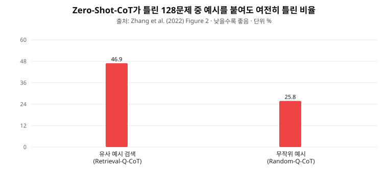
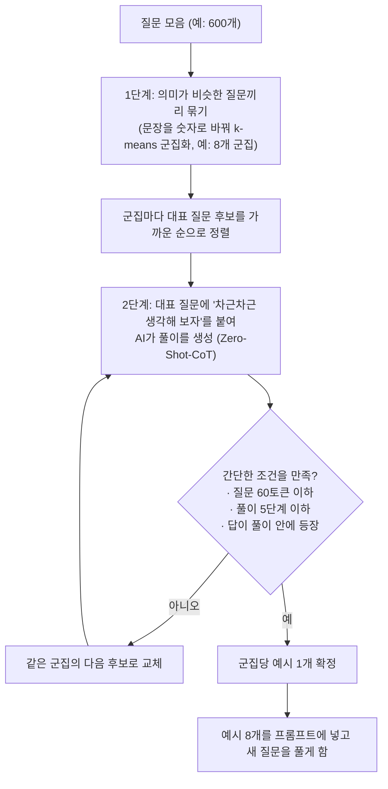
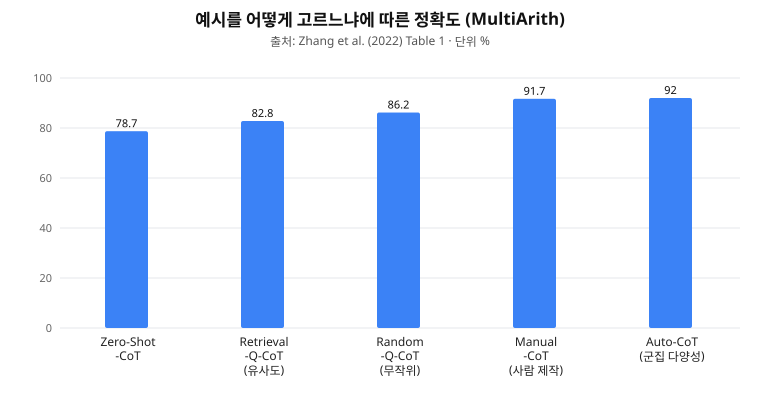
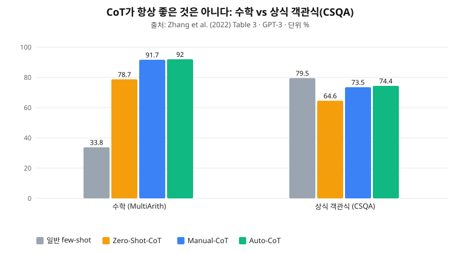

# "AI 예시를 AI가 직접 만들게 하자": Auto-CoT

> **논문**: *Automatic Chain of Thought Prompting in Large Language Models*
> **저자**: Zhuosheng Zhang(상하이 교통대), Aston Zhang, Mu Li, Alex Smola(Amazon Web Services) · **원문**: arXiv:2210.03493 (2022)
> **한 줄 요약**: AI가 단계별로 풀게 만드는 CoT 프롬프팅은 사람이 공들여 만든 예시가 필요한데, 이 예시를 **AI가 스스로 만들게** 하되 **"비슷한 것끼리 묶어 골고루 뽑는" 요령**을 쓰면 사람이 만든 것과 같거나 더 좋은 성능이 나온다.

**이 문서에 대하여**
- AI를 몰라도 읽을 수 있게 배경부터 설명합니다. 이 논문의 전작인 [CoT Prompting 논문 정리](../CoT%20Prompting/README.md)를 먼저 보면 더 쉽습니다.
- 논문 원문을 길게 옮기는 대신, **원문 위치(Section, Figure, Table 번호)** 를 표시했으니 원문과 대조하며 읽을 수 있습니다.
- 그래프는 논문의 수치를 바탕으로 **직접 다시 그린 것**입니다. 논문 원본 그림은 원문에서 확인하세요.
- **[논문]** 은 논문에 있는 내용, **[추론]** 은 제가 실무에 맞춰 덧붙인 해석입니다.

---

## 1. 배경: 이 논문을 이해하기 위한 기초

### 1-1. 프롬프트, few-shot, 그리고 CoT (3줄 복습)
- **프롬프트**: AI에게 주는 입력문입니다(질문, 지시, 예시).
- **few-shot**: AI를 새로 훈련시키지 않고, 프롬프트에 "문제와 정답" 예시 몇 개를 보여준 뒤 실제 문제를 풀게 하는 방식입니다.
- **CoT(Chain of Thought, 사고의 사슬)**: 예시에 정답뿐 아니라 **풀이 과정**을 함께 넣으면 AI가 복잡한 문제를 훨씬 잘 푼다는 발견입니다.

### 1-2. CoT의 두 가지 사용법 (원문 Figure 1)
| | Zero-Shot-CoT | Manual-CoT |
|---|---|---|
| 방법 | 질문 뒤에 **"차근차근 생각해 보자(Let's think step by step)"** 한 줄만 붙임 | 사람이 **문제+풀이+정답 예시**를 직접 만들어 프롬프트에 넣음 |
| 장점 | 예시가 필요 없어 간편함 | 성능이 더 좋음 |
| 단점 | 성능이 상대적으로 낮음 | **예시를 만드는 데 사람의 노력이 큼** |

### 1-3. 이 논문이 풀려는 문제
Manual-CoT의 성능은 **예시를 잘 만드는 사람의 솜씨에 좌우**됩니다. 논문(Section 3)은 앞선 연구를 인용해 이렇게 말합니다.

- 같은 과제에서 **작성자가 다르면 정확도가 최대 28.2%p** 차이가 난다.
- 문제마다 예시를 새로 만들어야 하므로 시간과 비용이 든다.

**질문**: 예시를 사람이 아니라 **AI가 자동으로 만들게 할 수는 없을까?**

---

## 2. 첫 번째 시도와 실패: 그냥 자동으로 만들면 안 될까?

가장 단순한 생각은 이렇습니다. "Zero-Shot-CoT로 AI가 풀이를 쓰게 한 다음, 그 풀이를 예시로 재활용하자." 그런데 두 가지 문제가 있었습니다.

1. **AI가 만든 풀이에도 오류가 섞인다.** Zero-Shot-CoT는 수학 문제집 MultiArith 600문제 중 **128문제(21.3%)를 틀렸습니다**(Section 3.1).
2. **새 문제와 "비슷한" 예시를 골라 붙이면 오히려 더 나쁘다.** 직관과 반대입니다. 논문은 이 현상을 **"유사성에 의한 오도(Misleading by Similarity)"** 라고 이름 붙였습니다.

---

## 3. 발견 ①: 비슷한 예시가 오히려 독이 된다 (원문 Section 3.1, Table 2, Figure 2)

**실험**: 새 문제마다 예시 8개를 붙이는데, 고르는 방법만 달리했습니다.
- **Retrieval-Q-CoT**: 새 문제와 **가장 비슷한** 문제 8개를 골라 예시로 삼는다.
- **Random-Q-CoT**: **무작위로** 8개를 고른다.

**결과**: Zero-Shot-CoT가 틀렸던 128문제 중, 예시를 붙여도 **여전히 틀린 비율**은 다음과 같습니다.



**왜 그럴까? (논문의 사례, Table 2)**
- "감자 9개를 삶아야 하는데 7개는 이미 삶았다. **나머지**를 삶는 데 걸리는 시간은?" 같은 문제가 있습니다.
- 비슷한 예시 3개가 모두 **"나머지"를 "전체"로 잘못 해석**한 풀이였습니다(AI가 스스로 만든 오답 풀이).
- 새 문제도 같은 예시를 보고 **똑같은 오해를 반복**했습니다.
- 반면 **무작위 예시**는 서로 다른 유형이라, 같은 실수를 따라 하지 않고 "나머지"를 올바르게 해석했습니다.

비유: 오답 노트에 같은 유형 오답만 잔뜩 있는 학생은 같은 실수를 반복하고, 여러 유형을 골고루 본 학생은 덜 반복합니다.

---

## 4. 발견 ②: AI의 실수는 특정 유형에 몰려 있다 (원문 Section 3.2, Figure 3, Appendix A.2)

**실험**: 600문제를 의미가 비슷한 8개 무리(군집)로 나누고, 무리별로 Zero-Shot-CoT의 오답률을 계산했습니다.

**결과 [논문]**
- 한 군집(Cluster 2)의 오답률이 **52.3%** 로 유독 높았습니다.
- 다른 데이터셋들, 군집 수를 바꿔도 **오류가 특정 군집에 몰리는 현상**이 반복되었습니다.

**함의**
- AI는 특정 유형의 문제에 **체계적으로 약합니다.**
- 그 유형 문제만 예시로 잔뜩 뽑으면(유사도 검색) 오답 예시가 한꺼번에 딸려 옵니다.
- 반대로 **군집마다 하나씩** 뽑으면(다양성), 오답 유형이 한 군집에 몰려 있는 이상 **오답 예시는 최대 1개**만 섞입니다. 8개 중 7개 이상(87.5%)이 정상일 확률이 높아집니다(Section 3.3).

---

## 5. 해결책: Auto-CoT의 작동 방식 (원문 Section 4, Figure 4, Algorithm 1·2)



**핵심 요령 3가지**
1. **군집화로 다양성 확보**: 비슷한 질문끼리 묶고 무리마다 1개씩 뽑는다.
2. **군집 중심에 가장 가까운 질문 선택**: 그 무리를 가장 잘 대표하는 질문이다. 실험에서 중심에 가까운 질문(93.7%)이 중심에서 먼 질문(88.7%)이나 무작위(89.2%)보다 좋았습니다(Appendix C.1, Table 8).
3. **간단한 필터로 나쁜 예시 걸러내기**: 너무 긴 질문(60토큰 초과), 너무 긴 풀이(5단계 초과), 풀이와 답이 맞지 않는 예시를 제외한다. 이 필터로 잘못된 예시 수가 MultiArith 기준 평균 1.3개에서 0.3개로 줄었습니다(Appendix C.2, Table 9).

---

## 6. 결과: 사람이 만든 예시와 견주어 어떤가 (원문 Section 5, Table 1·3)

### 6-1. 예시를 고르는 방식별 정확도 (MultiArith, Table 1)



- 자동으로 만든 Auto-CoT(92.0%)가 **사람이 만든 Manual-CoT(91.7%)와 같거나 약간 높았습니다.**
- 유사도로 고른 방식(82.8%)은 무작위(86.2%)보다도 낮았습니다.

### 6-2. 10개 과제 전체 (Table 3, GPT-3, 단위 %)

| 방법 | MultiArith | GSM8K | AddSub | AQuA | SingleEq | SVAMP | CSQA | Strategy | Letter | Coin |
|---|---|---|---|---|---|---|---|---|---|---|
| Zero-Shot | 22.7 | 12.5 | 77.0 | 22.4 | 78.7 | 58.8 | 72.6 | 54.3 | 0.2 | 53.8 |
| Zero-Shot-CoT | 78.7 | 40.7 | 74.7 | 33.5 | 78.7 | 63.7 | 64.6 | 54.8 | 57.6 | 91.4 |
| Few-Shot (풀이 없음) | 33.8 | 15.6 | 83.3 | 24.8 | 82.7 | 65.7 | 79.5 | 65.9 | 0.2 | 57.2 |
| Manual-CoT (사람) | 91.7 | 46.9 | 81.3 | 35.8 | 86.6 | 68.9 | 73.5 | 65.4 | 59.0 | 97.2 |
| **Auto-CoT (자동)** | **92.0** | **47.9** | **84.8** | **36.5** | **87.0** | **69.5** | **74.4** | 65.4 | **59.7** | **99.9** |

- **[논문]** 10개 과제(수학 6, 상식 2, 기호 2) 전반에서 Auto-CoT는 Manual-CoT와 **같거나 더 높았습니다.** (Auto-CoT는 3번 반복 실행의 평균)
- 다른 모델(Codex)에서도 경쟁력이 있었습니다(Table 4).
- 사람이 만든 예시는 비용 때문에 여러 데이터셋에 **같은 예시를 재사용**(수학 6개 중 5개)하는 반면, Auto-CoT는 **데이터셋마다 맞춤 예시**를 자동 생성합니다.

### 6-3. 주의: 모든 과제에서 CoT가 이기는 것은 아니다



- 수학(MultiArith)에서는 CoT 계열이 압도적입니다(33.8% → 91.7%~92.0%).
- 하지만 **상식 객관식(CSQA)** 에서는 풀이 없는 few-shot(79.5%)이 CoT 계열(73.5%, 74.4%)보다 **더 높습니다.** 풀이를 쓰지 않는 Zero-Shot(72.6%)이 Zero-Shot-CoT(64.6%)보다 높기도 합니다.
- **분류, 객관식 성격의 과제에서는 CoT가 손해일 수 있다**는 신호이며, 실무 적용 시 가장 중요한 교훈입니다.

---

## 7. 추가 검증

| 검증 | 결과 [논문] | 원문 위치 |
|---|---|---|
| **오답 예시가 섞이면?** | 예시의 최대 50%가 오답이어도 Auto-CoT의 성능은 크게 떨어지지 않음. 같은 군집에서만 뽑는 방식은 더 크게 하락 | Section 5.5, Figure 6 |
| **예시의 어떤 요소가 중요한가?** | 질문을 섞으면 91.7 → 73.8, **풀이나 답을 섞으면 43.8 / 17.0**으로 급락. 풀이와 답이 서로 맞는 것이 가장 중요 | Appendix A.1, Table 5 |
| **질문이 한꺼번에 오지 않고 조금씩 들어온다면?** (스트리밍) | 처음 몇 개를 풀며 예시를 쌓아 가는 방식(Auto-CoT*)이 2번째 묶음부터 Manual-CoT와 비슷해짐 | Section 5.6, Figure 7 |
| **풀이와 답이 안 맞는 예시의 위험** | 풀이 내용과 최종 답이 어긋난 예시(논문 사례는 식은 세웠는데 답은 엉뚱한 값)는 AI가 "근거 없이 답을 찍는 법"을 배우게 할 수 있음 | Appendix A.1, Table 6 |

---

## 8. 핵심 개념 3가지 (한 장 요약)

1. **"비슷한 예시"가 항상 좋은 것은 아니다 (Misleading by Similarity).** AI가 만든 풀이에는 오류가 섞이는데, 비슷한 예시를 고르면 같은 오류가 함께 딸려 와 반복된다.
2. **군집별 대표 1개씩, 골고루 뽑는다 (다양성 샘플링).** AI의 실수는 특정 유형에 몰려 있으므로, 유형별로 하나씩 뽑으면 오답 예시의 영향이 작아진다.
3. **풀이와 답이 서로 맞아야 한다 (Rationale-Answer Consistency).** 질문이 어색한 것보다 풀이와 답이 불일치하는 것이 성능을 훨씬 크게 떨어뜨린다. 간단한 필터로 이런 예시를 걸러낸다.

---

## 9. 실무 적용: 영업 메모를 광고주 상태로 분류하기

**[추론]** 이 논문은 수학·상식·기호 문제를 다뤘고 문서 분류는 다루지 않습니다. 아래는 개념을 분류 업무로 옮긴 제 해석입니다.

**시나리오**: 세일즈 담당자가 남긴 자유 서식 영업 메모를 읽고 광고주 상태(유지 / 확장 / 위험 / 불만)로 자동 분류한다.

### 9-1. 예시(few-shot)를 자동으로 구성하는 파이프라인
1. 과거 영업 메모를 전부 숫자 벡터(임베딩)로 바꾼 뒤 **군집화**한다. (군집 수는 라벨 수보다 넉넉하게)
2. 군집마다 **중심에 가까운 메모 1개**를 뽑는다. 비슷한 메모만 여럿 뽑지 않는다.
3. 뽑은 메모에 AI가 "판단 근거"를 쓰게 한다. 과거에 사람이 확정한 **정답 라벨이 있으면** AI의 결론이 그 라벨과 같은 것만 남긴다. 논문은 정답 라벨이 없는 상황을 가정했으므로, 라벨이 있는 실무 환경은 더 유리합니다.
4. **근거가 결론을 뒷받침하는지 검증**한다(논문의 "답이 풀이 안에 등장" 필터에 해당). 어긋나면 그 예시를 버리고 같은 군집의 다음 메모로 교체한다.

### 9-2. 분류 프롬프트 구조

```
[지시]
당신은 광고 플랫폼의 광고주 케어 분석가입니다.
영업 메모를 읽고 광고주 상태(유지/확장/위험/불만)를 분류하세요.
아래 단계로 근거를 쓰고, 마지막 줄에 "최종 판단: <라벨>"을 쓰세요.
 1. 메모에서 사실만 인용   2. 각 사실을 긍정/부정/중립으로 표시
 3. 근거가 부족하거나 상충하면 "모호"로 표시   4. 상태 정의와 대조   5. 라벨과 확신도

[예시 k개]  ← 군집별 대표 메모 + 검증을 통과한 근거

[실제 메모]
메모: "{분류할 메모}"
```

- 메모가 모호하면 억지로 라벨을 고르지 말고 **"모호, 사람 검토 필요"** 로 넘기도록 지시한다(3단계). 이는 논문이 지적한 "근거 없이 답을 찍는" 위험을 줄이는 장치입니다.

---

## 10. 한계와 실무 고려사항

**논문 자체의 한계 (본문과 실험 설정에서 확인되는 점)**
- 평가 과제가 수학, 상식, 기호 추론으로 한정되고 **문서 분류나 비정형 텍스트는 없다.**
- 2022년 기준 모델(GPT-3 text-davinci-002, Codex)로만 실험했다.
- 토큰 비용, 응답 속도는 **측정하지 않았다.**
- 자동 생성 예시에도 오류가 섞일 수 있어, 성능은 필터와 다양성 확보에 의존한다.

**실무 관점의 [추론]**

| 항목 | 우려 | 대응 |
|---|---|---|
| 토큰 비용 | 예시 k개에 각각 풀이가 붙어 입력이 길어지고, 출력도 길어짐 | 예시는 한 번만 구성해 고정하고 캐싱, 풀이 단계 수 제한, 쉬운 메모는 CoT 없이 처리 |
| 응답 속도 | 출력이 길어진 만큼 느려짐 | 실시간이 필요 없으면 배치 처리 |
| 환각 | 그럴듯하지만 근거 없는 풀이 | 메모 원문에서 **인용한 문장**을 근거로 강제하고, 인용이 실제로 있는지 검증 |
| 효과 불확실성 | 분류 과제에서 CoT가 오히려 손해일 수 있음 (CSQA 사례) | **"풀이 없는 few-shot" 대 "CoT" A/B 비교**를 같은 라벨셋으로 먼저 수행 |
| 신규 유형 발생 | 새 유형의 메모가 계속 들어옴 | 예시를 주기적으로 재군집화해 갱신 (논문 스트리밍 실험의 아이디어) |
| 개인정보 | 영업 메모에 고객사 정보 포함 | 외부 API 전송 전 마스킹, 보안 정책 확인 |

---

## 11. 용어집

| 용어 | 쉬운 설명 |
|---|---|
| LLM (대규모 언어모델) | 방대한 글로 훈련된 ChatGPT류 AI 엔진 |
| few-shot | 프롬프트에 예시 몇 개를 넣어 보여준 뒤 문제를 풀게 하는 방식 |
| CoT | 답에 이르는 중간 풀이 과정. 사고의 사슬 |
| Zero-Shot-CoT | 예시 없이 "차근차근 생각해 보자"만 붙여 풀이를 유도하는 방식 |
| Manual-CoT | 사람이 직접 만든 풀이 예시를 넣는 방식 |
| 군집화(clustering) | 비슷한 것끼리 자동으로 무리 짓는 기법. 여기서는 k-means 사용 |
| 임베딩(Sentence-BERT) | 문장을 의미가 담긴 숫자 벡터로 바꾸는 방법. 비슷한 문장은 가까운 벡터가 됨 |
| 토큰 | AI가 글을 처리하는 기본 단위. 대략 단어나 글자 조각. 비용과 속도의 기준 |
| Misleading by Similarity | 비슷한 예시의 오류가 새 문제에서 반복되는 현상 |

## 12. 원문 위치 안내

| 내용 | 원문 위치 |
|---|---|
| Zero-Shot-CoT와 Manual-CoT 비교 그림 | Figure 1 |
| 유사도 검색 vs 무작위 실험 | Section 3, Table 1 |
| Misleading by Similarity 분석과 사례 | Section 3.1, Figure 2, Table 2 |
| 오류가 특정 군집에 몰림 | Section 3.2, Figure 3, Appendix A.2 |
| 다양성이 오류를 완화하는 이유 | Section 3.3 |
| Auto-CoT 방법과 알고리즘 | Section 4, Figure 4, Algorithm 1·2 |
| 10개 과제 결과 | Section 5.2, Table 3 |
| 군집 시각화 | Section 5.3, Figure 5 |
| 다른 모델(Codex) | Section 5.4, Table 4 |
| 오답 예시의 영향 | Section 5.5, Figure 6 |
| 스트리밍 설정 | Section 5.6, Figure 7 |
| 예시 요소별 영향 | Appendix A.1, Table 5·6 |
| 중심 거리, 필터의 효과 | Appendix C.1·C.2, Table 8·9 |
